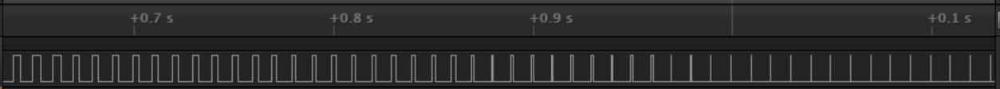

Name:Stephen Do

EID:svd389

Team Number:

## Questions

1. Why does your program need a setup and a loop?

    There needs to be an area of code that is only run once and a segment of code that loops forever.

2. What is the downside to putting all your code in a loop?

    The code would be harder to manage if all the code including variable were re-initialized. The program would also 
	perform worse if it repeated all lines of code. 

3. Why does your code need to be compiled?

    Code needs to be complied because the code that we write needs to be translated into assembly language and then into binary 
	that the computer can understand.

4. When lowering the frequency in procedure A, step 4, what is going wrong? Brainstorm some solutions. Dimmers exist in the real world. What is their solution?

    Brightness is controlled by time on, so when the frequency is too low the flickering effct is noticable. Dimmers function by lowering the frequency of the lights
	and they work best with a incandecent light bulbs that function on a more analog curve. 

5. Why do you need to connect the logic analyzer ground to the ESP32 ground?

    You need to connect the logic analyzer to ground so you can have a complete circuit. 

6. What is the difference between synchronous and asynchronous communication?

    The difference between synchronous and asynchronous communication is that synchronous communication relies on a clock to regulate signal transmission, while asynchronous 
	communication is able to send singnals as soon as they are ready. 

7. Profile of UART: Sent X bytes in Y time 

    Sent 10 bytes in 10.31 ms.

8. Profile of SPI: Sent X bytes in Y time

    Sent 10 bytes in .26 ms.

9. Why is SPI so much faster than UART?

    SPI is faster than UART because it's a software protocall that doesn't require the functioning of a hardware
	component like UART. SPI is also a more streamlined function than UART.

10. list one pro and one con of UART

    Pro: UART uses less pins that SPI, Con: UART is slower that SPI

11. list one pro and one con of SPI

    Pro: SPI is cheaper to implement than UART, Con: SPI is harder to implement with various peripherals

12. list one pro and one con of I2C

    Pro: Best range of data transfer, Con: Largest amount of complexity

13. Why does I2C need external resistors to work?

    External resistors are needed to make the signal high when there is no device is trying to make the signal low.

## Screenshots

Procedure A, step 1:

Procedure A, step 4:

Procedure B, UART:

Procedure B, SPI:

